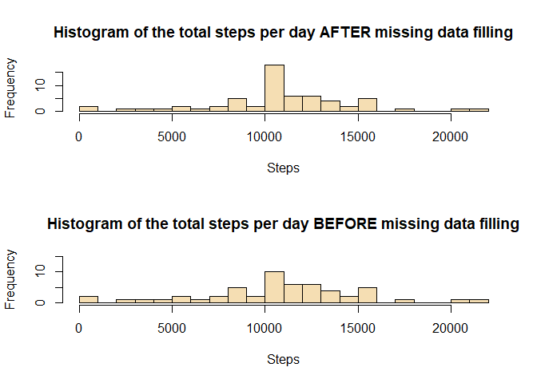

Reproducible research Course Project 1
--------------------------------------

1. Loading and preprocessing the data
-------------------------------------

### 1.1. Unzip and read the data from the GitHub repository. Dimensional exploration.

1.  Load the data (i.e. read.csv()).

<!-- -->

    act <- read.csv("activity.csv")

What is mean total number of steps taken per day?
-------------------------------------------------

1.  Calculate the total number of steps taken per day.

<!-- -->

    library(dplyr)

    ## 
    ## Attaching package: 'dplyr'

    ## The following objects are masked from 'package:stats':
    ## 
    ##     filter, lag

    ## The following objects are masked from 'package:base':
    ## 
    ##     intersect, setdiff, setequal, union

    actSum <- act %>% group_by(date) %>% summarise(stepSum = sum(steps))

1.  Make a histogram of the total number of steps taken each day.

<!-- -->

    hist(actSum$stepSum, breaks = 10, main = "total number of steps taken each day", xlab = "Steps", col = "wheat")

1.  Calculate and report the mean and median of the total number of
    steps taken per day.

<!-- -->

    actMean <- act %>% group_by(date) %>% summarise(stepSum = mean(steps))
    actMedian <- act %>% group_by(date) %>% summarise(stepSum = median(steps))

What is the average daily activity pattern?
-------------------------------------------

1.  a time series plot (i.e. type = "l") of the 5-minute interval
    (x-axis) and the average number of steps taken, averaged across all
    days (y-axis).

<!-- -->

    actInt <- act %>% group_by(interval) %>% summarise(stepInt = sum(steps, na.rm = T))
    plot(actInt$interval, actInt$stepInt, type = "l", main = "average no. of steps taken", ylab = "averaged across all day", xlab = "5-min interval")

1.  Which 5-minute interval, on average across all the days in the
    dataset, contains the maximum number of steps?

<!-- -->

    maxint <- actInt[actInt$stepInt == max(actInt), 1]
    maxint

    ## # A tibble: 1 x 1
    ##   interval
    ##      <int>
    ## 1      835

Imputing missing values
-----------------------

1.  Calculate and report the total number of missing values in the
    dataset.

<!-- -->

    sum(is.na(act))

    ## [1] 2304

1.  Devise a strategy for filling in all of the missing values in the
    dataset. The strategy does not need to be sophisticated. For
    example, you could use the mean/median for that day, or the mean for
    that 5-minute interval, etc.

Strategy taken is to substitute each NA with a fixed value. I set the
fixed value equivalent to the overall mean of the variable act$steps.

1.  Create a new dataset that is equal to the original dataset but with
    the missing data filled in.

<!-- -->

    act2 <- act
    act2$steps[is.na(act2$steps)] <- mean(na.omit(act$steps))
    sum(is.na(act2))

    ## [1] 0

1.  Make a histogram of the total number of steps taken each day and
    Calculate and report the mean and median total number of steps taken
    per day. Do these values differ from the estimates from the first
    part of the assignment? What is the impact of imputing missing data
    on the estimates of the total daily number of steps?

<!-- -->

    ## Report

    sum_mean_median_day <- group_by(act2, date) %>%
         summarise(sum_steps = sum(steps),
                   mean_steps = mean(steps),
                   median_steps = median(steps))
     sum_mean_median_day

    ## # A tibble: 61 x 4
    ##    date       sum_steps mean_steps median_steps
    ##    <fct>          <dbl>      <dbl>        <dbl>
    ##  1 2012-10-01     10766     37.4           37.4
    ##  2 2012-10-02       126      0.438          0  
    ##  3 2012-10-03     11352     39.4            0  
    ##  4 2012-10-04     12116     42.1            0  
    ##  5 2012-10-05     13294     46.2            0  
    ##  6 2012-10-06     15420     53.5            0  
    ##  7 2012-10-07     11015     38.2            0  
    ##  8 2012-10-08     10766     37.4           37.4
    ##  9 2012-10-09     12811     44.5            0  
    ## 10 2012-10-10      9900     34.4            0  
    ## # ... with 51 more rows

     ## Histogram
     par(mfcol = c(2,1))
     hist(sum_mean_median_day$sum_steps, main = "Histogram of the total steps per day AFTER missing data filling", xlab = "Steps", breaks = 16, col = "wheat")
     hist(actSum$stepSum, main = "Histogram of the total steps per day BEFORE missing data filling", xlab = "Steps",   breaks = 16, col = "wheat", ylim = c(0,15))

Are there differences in activity patterns between weekdays and weekends?
-------------------------------------------------------------------------

1.  Create a new factor variable in the dataset with two levels -
    "weekday" and "weekend" indicating whether a given date is a weekday
    or weekend day.

<!-- -->

    act2$date = as.Date(act2$date, "%Y-%m-%d")
    state <- ifelse(weekdays(act2$date) %in% c("Saturday", "Sunday"), "weekend", "weekday")
    state <- as.factor(state)
    act2$state <- state

1.  Make a panel plot containing a time series plot of the 5-minute
    interval (x-axis) and the average number of steps taken, averaged
    across all weekday days or weekend days (y-axis). See the README
    file in the GitHub repository to see an example of what this plot
    should look like using simulated data.

<!-- -->

    library(ggplot2)
    average_steps_state <- group_by(act2, state, interval) %>% summarise(average_steps = mean(steps))

    ggplot(average_steps_state, aes(x = interval, y = average_steps)) +
        geom_line() + 
        facet_grid(state ~ .) + 
        labs(x = "Interval") + 
        labs(y = "Number of steps")

